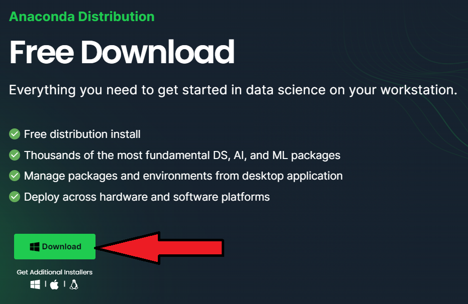
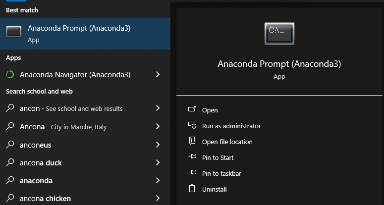

# Medical Informatics Engineering - Summer Intern Project

#### Project worked on by **Rayed Suhail Ahmad**
#### Start of Project **June 19, 2023**

## Introduction
This project aims to develop a deep learning network that utilizes a few-shot or one-shot approach to training. This network should be capable of determining similarities between two image documents of medical records so that new documents can be added and categorized accordingly. The use of few-shot or one-shot learning techniques helps us design the neural network without the need for extensive retraining.

## Objectives
- Development of a Deep Learning neural network capable of determining the document type based on a few-shot or one-shot learning approach
- Integrate neural network with an existing system with speed and accuracy
- Render a CodeBullet-themed video monitoring the process of development from start to finish

## Methodology
- Gather and preprocess available medical documents for use by model
- Develop and test different model architectures utilized for object classification by utilizing ML frameworks and libraries (Keras, TensorFlow, Pandas, NumPy)
- Train and validate a model using a subset of the document types and then confirm performance for the remaining documents
- [OPTIONAL] Test the performance of the model in classifying a subset of documents that may differ from the ones trained on
- Utilize different performance metrics such as accuracy, precision, and F-score for evaluation of model
- Record and maintain the workflow to be utilized for the final video creation
- Edit together and record voice-overs for explaining the project

## To-Do List of Tasks
- [x] ~Use ADP timecard for hour tracking~
- [x] ~Create Internship Charter Document~
- [x] ~Finish YT Playlist to gain information about AI~ ([Link](https://www.youtube.com/playlist?list=PLuIoQNgtU5vq1tJWHngx91N5ndkHpT2Mg))
- [ ] Gather dataset from Doug
- [ ] Setup access to Tesla hardware for model training
- [x] ~Gather alternate dataset for developing proof-of-concept~
- [x] ~Setup environment for model training~
- [x] ~Prepare dataset to be used for training, testing, and validation purposes~
- [x] ~Design model architecture for document classification~
- [x] ~Choose appropriate hyperparameters to maximize performance~
- [x] ~Code appropriate algorithm for few-shot learning~
- [ ] Record performance and visuals to be utilized in video

## Setting up Anaconda Environment
To utilize the code written in this repo, please follow the following instructions for installing Anaconda and creating a conda environment for running the code by utilizing the provided `environment.yml` file. 

1. Utilize the [link](https://www.anaconda.com/download) to install the Anaconda installer.



2. Once the installer has been downloaded, utilize the [installation guide](https://docs.anaconda.com/free/anaconda/install/index.html) for your device and follow the steps provided on the page ([Windows](https://docs.anaconda.com/free/anaconda/install/windows/), [macOS](https://docs.anaconda.com/free/anaconda/install/mac-os/), [Linux](https://docs.anaconda.com/free/anaconda/install/linux/)).

3. Once you have followed all the steps, [verify your installation](https://docs.anaconda.com/free/anaconda/install/verify-install/) of Anaconda by opening the Anaconda Prompt console (for Windows) or typing `conda list` in your terminal for Ubuntu or macOS.



4. Using the console, navigate to where you cloned this repository and type the following command to create a duplicate virtual environment to the one that was used to train the model:

`conda env create -f environment.yml`

5. Once the process completes, you can activate the environment by running the command:

`conda activate mieml`

While in this environment you can utilize the same packages that were utilized in creating the model by using the `python` command and running a Python console directly in the Anaconda Prompt. However, for using IDE we suggest `Spyder` as it allows for amazing graphical features like Variable Explorer, Python Terminal Manager, and Code Editor. Spyder can be started using the current conda environment by running the following command:

`spyder`

## Getting the Data

The data is pulled from [Dataset Card for RVL-CDIP](https://huggingface.co/datasets/aharley/rvl_cdip) on Huggingface. Only the file for the images is needed: https://huggingface.co/datasets/aharley/rvl_cdip/blob/main/data/rvl-cdip.tar.gz

```
curl https://huggingface.co/datasets/aharley/rvl_cdip/blob/main/data/rvl-cdip.tar.gz
```

Unzip the `.tar` file into the `datasets/` folder such that the file structure looks as follows (`*` is a wildcard to represent lower-case alphabets from a-z):

```bash
│   .gitignore
│   environment.yml
│   README.md
│
├───dataset
│   │   readme.txt
│   │   rvl_cdip.py
│   │
│   ├───images
│   │       images*
│   │
│   └───labels
│           invalid_imgs.txt
│           test.txt
│           train.txt
│           val.txt
│
├───results
│   │   AlexNet_Siamese_history
│   │   OneShot_Siamese_history
│   │   ResNet_Siamese_history
│   │   Siamese_Contrastive_Siamese_history
│   │   VGGNet_Siamese_history
│   │
│   ├───AlexNet_Siamese
│   │       Base_Model.png
│   │       Model_Accuracy.png
│   │       Model_Loss.png
│   │       Model_Predictions.png
│   │       Siamese_Model.png
│   │
│   ├───OneShot_Siamese
│   │       Base_Model.png
│   │       Model_Accuracy.png
│   │       Model_Loss.png
│   │       Model_Predictions.png
│   │       Siamese_Model.png
│   │
│   ├───ResNet_Siamese
│   │       Base_Model_1.png
│   │       Base_Model_2.png
│   │       Base_Model_3.png
│   │       Base_Model_4.png
│   │       Base_Model_5.png
│   │       Base_Model_6.png
│   │       Model_Accuracy.png
│   │       Model_Loss.png
│   │       Model_Predictions.png
│   │       Siamese_Model.png
│   │
│   ├───Siamese_Contrastive_Siamese
│   │       Base_Model.png
│   │       Model_Accuracy.png
│   │       Model_Loss.png
│   │       Model_Predictions.png
│   │       Siamese_Model.png
│   │
│   └───VGGNet_Siamese
│           Base_Model.png
│           Model_Accuracy.png
│           Model_Loss.png
│           Model_Predictions.png
│           Siamese_Model.png
│
└───script
        data_visualizers.py
        image_loader.py
        model_creation.py
        model_training.py
        training_helpers.py
        utils.py
```

## Using this repo
Once you have your IDE and environment set up, you can easily run the files found in this repository. If you just run the file `model_training.py`, you will create all the necessary models and history files of the 5 model architectures. To change a few of the hyperparameters associated with the training and visualization process, please make the appropriate changes to the variables as per your own requirement. If you wish to retrain the models, you will need to delete the original models or change the directory stored in variables `MODEL_SAVE_PATH` and `HISTORY_SAVE_PATH` in the file `utils.py`.

Once you have trained the models once, you will need to comment the three lines of code that perform the multiprocessing from `line 55-57` in the `model_training.py` file and uncomment `line 60`. If you have enough memory capacity then you can always just use `line 60` so that you can see the visualizations along with model training as running multiprocessing threads surpresses the figures being displayed.

In case you are unable to see any output or face an error when running a piece of code, please ensure that you read the comments associated with the code block and understand the requirements of the function or snippet of code.
